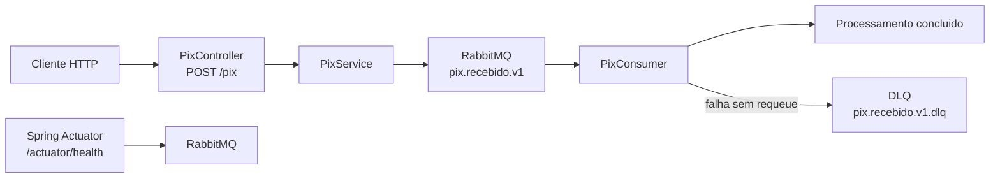

# SafePix Async


API Java com Spring Boot e RabbitMQ que recebe solicitacoes Pix por HTTP, publica mensagens em uma fila e processa tudo de forma assincrona.

## Arquitetura



## Tecnologias

- Java 21
- Spring Boot 4
- Spring AMQP
- RabbitMQ
- Docker Compose
- SpringDoc OpenAPI
- Spring Actuator
- JUnit 5, Mockito e Testcontainers

## Como rodar tudo com Docker Compose

```bash
docker compose up --build
```

Servicos locais:

- API: http://localhost:8080
- Swagger UI: http://localhost:8080/swagger-ui.html
- Health: http://localhost:8080/actuator/health
- RabbitMQ Management: http://localhost:15672

Credenciais RabbitMQ:

- Usuario: `safepix`
- Senha: `safepix`

Para parar:

```bash
docker compose down
```

## Como rodar localmente

Suba apenas RabbitMQ:

```bash
docker compose up -d rabbitmq
```

Depois rode aplicacao:

```powershell
.\mvnw.cmd spring-boot:run
```

## Requisicao Pix valida

```bash
curl -i -X POST http://localhost:8080/pix \
  -H "Content-Type: application/json" \
  -d '{
    "id": "11111111-1111-1111-1111-111111111111",
    "chavePix": "cliente@email.com",
    "valor": 150.75,
    "timestamp": "2026-05-24T21:00:00Z"
  }'
```

Resposta esperada:

```http
HTTP/1.1 202 Accepted
```

Efeito esperado:

- Mensagem publicada na fila `pix.recebido.v1`
- Consumer processa mensagem em segundo plano
- Log registra recebimento, envio e processamento

## Requisicao Pix invalida

```bash
curl -i -X POST http://localhost:8080/pix \
  -H "Content-Type: application/json" \
  -d '{
    "id": "22222222-2222-2222-2222-222222222222",
    "chavePix": "cliente@email.com",
    "valor": 0,
    "timestamp": "2026-05-24T21:00:00Z"
  }'
```

Resposta esperada:

```http
HTTP/1.1 400 Bad Request
Content-Type: application/json
```

Motivo: campo `valor` precisa ser positivo.

## DLQ

Mensagens invalidas que chegam diretamente ao RabbitMQ e falham no consumer sao rejeitadas sem requeue e enviadas para:

```text
pix.recebido.v1.dlq
```

Esse comportamento e validado pelos testes de integracao com Testcontainers.

## Testes

```powershell
.\mvnw.cmd test
```

Os testes de integracao sobem RabbitMQ real via Testcontainers. Docker Desktop precisa estar rodando.

## Endpoints principais

| Metodo | Rota | Descricao |
| --- | --- | --- |
| POST | `/pix` | Recebe solicitacao Pix e publica mensagem |
| GET | `/actuator/health` | Verifica saude da aplicacao |
| GET | `/swagger-ui.html` | Abre documentacao OpenAPI |

## Variaveis de ambiente

| Variavel | Padrao | Descricao |
| --- | --- | --- |
| `SPRING_RABBITMQ_HOST` | `localhost` | Host RabbitMQ |
| `SPRING_RABBITMQ_PORT` | `5672` | Porta RabbitMQ |
| `SPRING_RABBITMQ_USERNAME` | `guest` | Usuario RabbitMQ |
| `SPRING_RABBITMQ_PASSWORD` | `guest` | Senha RabbitMQ |

